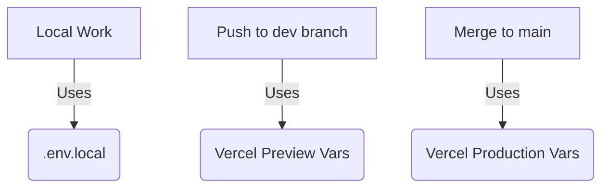

## github developer setting OAuth URL
Branch 'main'
Homepage URL: https://alifewsl.vercel.app
Callback URL: https://alifewsl.vercel.app/api/auth/callback/github

Branch 'dev' 
Homepage URL: http://localhost:3000
Callback URL: http://localhost:3000/api/auth/callback/github


## pages/api/auth/[...nextauth].ts
const github Auth 'main'
clientId: process.env.GITHUB_PROD_CLIENT_ID!
clientSecret: process.env.GITHUB_PROD_CLIENT_SECRET!

const github Auth 'dev'
clientId: process.env.GITHUB_DEV_CLIENT_ID!
clientSecret: process.env.GITHUB_DEV_CLIENT_SECRET!


## .env.local     
Branch      |   Vercel Env   |     NEXTAUTH_URL
'main'      |  (Preview)     | https://alifewsl.vercel.app
'dev'       |  (Production)  | http://localhost:3000

## nextjs env settings
'main' -> production; 'dev' -> development;
pages/api/auth[...nextauth].ts -> ln65 
```bash
 debug: process.env.NODE_ENV === 'production',
 ```

## Mongo Atlas IP address settings
For Vercel deployment:
Set Mongo Atlas whitelist IP address or access from anywhere 0.0.0.0/0 

######################################################

Qn: with dev and branch, each with different .env for git oauth right?  And the paired gitnoauth in vercel is preview for dev, production for main.
## Deepseek
Exactly! You've got the right understanding. Here's the clean, professional way to set this up:

### üåê **Environment Architecture**
| Environment  | Git Branch | Vercel Env  | GitHub OAuth App | .env File        |
|--------------|------------|-------------|------------------|------------------|
| **Local**    | -          | -           | Dev App          | `.env.local`     |
| **Preview**  | `dev/*`    | Preview     | Dev App          | (Vercel-managed) |
| **Production**| `main`    | Production  | Prod App         | (Vercel-managed) |

### üîß **Implementation Steps**

1. **GitHub OAuth Apps Setup**
   - **Production App** (`main` branch):
     ```text
     Homepage: https://alifewsl.vercel.app
     Callback: https://alifewsl.vercel.app/api/auth/callback/github
     ```
   - **Development App** (local + preview):
     ```text
     Homepage: http://localhost:3000
     Callback: 
       http://localhost:3000/api/auth/callback/github
       https://alifewsl-*-git-*.vercel.app/api/auth/callback/github
     ```

2. **Vercel Environment Variables**
   ```bash
   # Production (main branch)
   vercel env add GITHUB_CLIENT_ID production <prod-client-id>
   vercel env add GITHUB_CLIENT_SECRET production <prod-secret>

   # Preview (all other branches)
   vercel env add GITHUB_CLIENT_ID preview <dev-client-id>
   vercel env add GITHUB_CLIENT_SECRET preview <dev-secret>
   ```

3. **Local Development (`.env.local`)**
   ```bash
   GITHUB_CLIENT_ID=<dev-client-id>
   GITHUB_CLIENT_SECRET=<dev-secret>
   NEXTAUTH_URL=http://localhost:3000
   ```

### ‚ö° **How It Works**
- **Pushing to `main`**: Uses Production OAuth App with production credentials
- **Pushing to `dev`**: Uses Development OAuth App with dev credentials
- **Local development**: Uses same Development OAuth App

### üîç **Verification Checklist**
1. Ensure **two separate GitHub OAuth apps** exist
2. **All callback URLs** are registered correctly
3. Vercel's **Production/Preview** vars are set
4. `.env.local` exists but is gitignored

This gives you complete isolation between environments while keeping the configuration clean. Would you like me to show the exact GitHub OAuth app settings screens?

Qn: in both branches, the same .env.local file name?  but with different github oauth credentials?
## Deepseek
Here's the clear breakdown of how to handle `.env` files across environments:

### üåü **The Golden Rule**
**`.env.local` only exists in local development** - it should never be in Git or used in Vercel deployments. Here's the proper setup:

---

### 📁 **File Structure**
```
.gitignore          # Ignores all .env* except .env.example
.env.example        # Template (committed)
└── (Shows ALL possible variables)
.env.local          # Local dev only (gitignored)
```

### 🔄 **Environment-Specific Credentials**

| Environment | Where Credentials Live | GitHub App Used |
|-------------|------------------------|-----------------|
| **Local** | `.env.local` | Dev App |
| **Preview** (dev branch) | Vercel Preview Env Vars | Dev App |
| **Production** (main) | Vercel Production Env Vars | Prod App |

---

### 💻 **Local Development**
1. **Single `.env.local` file** with dev credentials:
   ```bash
   # .env.local (never committed)
   GITHUB_CLIENT_ID=dev_123
   GITHUB_CLIENT_SECRET=dev_abc
   NEXTAUTH_URL=http://localhost:3000
   ```

2. **Uses Development GitHub OAuth App**  
   (Registered for `localhost:3000`)

---

### ☁️ **Vercel Deployments**
1. **Preview Deployments** (dev branch):  
   - Uses **Vercel Preview Env Vars**  
   - Same dev credentials as local  
   ```bash
   vercel env add GITHUB_CLIENT_ID preview dev_123
   vercel env add GITHUB_CLIENT_SECRET preview dev_abc
   ```

2. **Production Deployments** (main branch):  
   - Uses **Vercel Production Env Vars**  
   - Different prod credentials  
   ```bash
   vercel env add GITHUB_CLIENT_ID production prod_456
   vercel env add GITHUB_CLIENT_SECRET production prod_def
   ```

---

### ‚úÖ **Key Clarifications**
1. **No branch-specific `.env` files** - Vercel uses its own environment variables
2. **Same variable names**, different values per environment
3. **Local vs Vercel** separation:
   ```mermaid
   graph LR
     A[Local .env.local] -->|Dev Creds| B(Localhost)
     C[Vercel Preview] -->|Dev Creds| D(Preview Deploys)
     E[Vercel Production] -->|Prod Creds| F(Production Deploys)
   ```

This ensures clean separation while avoiding file duplication. The same `.env.local` works locally because Vercel deployments don't use local files at all!

Qn: Oic, so .env.local would also work for my local deployment, there's no need for two different .env.dev and .env.production in my dev and main branches, cause the production env.var are already in vercel production env var.

## Deepseek
Exactly! You've got it perfectly. Here's the crystal-clear breakdown:

### ‚úÖ **The Simplified Truth**
1. **`.env.local`**  
   - Only file you need locally  
   - Contains **dev credentials** (GitHub OAuth for localhost)  
   - Never committed to Git (in `.gitignore`)  

2. **Vercel Deployments**  
   - **Doesn't use any `.env` files**  
   - Preview (dev branch) ‚Üí Uses **Preview** env vars from Vercel UI  
   - Production (main) ‚Üí Uses **Production** env vars from Vercel UI  

### 🛠️ **What You Should Do Today**
1. **Delete these forever** 🗑️:  
   ```bash
   .env.dev       # Not needed
   .env.production # Not needed
   ```
2. **Keep only**:  
   ```bash
   .env.local     # For your machine only
   .env.example   # Template (safe to commit)
   ```

### üåê **Real-World Workflow**


### 💻 **Code Stays Clean**
```javascript
// Works EVERYWHERE (local/preview/production)
process.env.GITHUB_ID 
// No file extensions, no branch checks needed
```

### üîí **Why This is More Secure**
- Production secrets **never** touch your local machine  
- No risk of accidentally committing `.env.production`  
- Vercel manages production vars separately  

You've reached the **ideal setup** - congratulations! üéâ This is exactly how professional teams structure their environments.